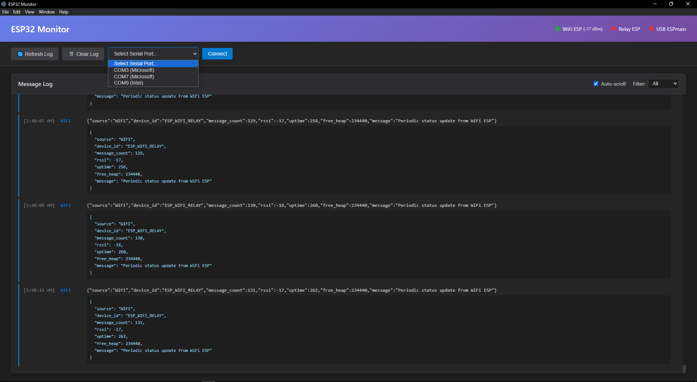

# ESP32 Monitor Prototype


<p align="center">
   
</p>

A professional Electron application that monitors and displays data from ESP32 devices through multiple communication paths: WiFi WebSocket, ESP-NOW relay, and USB Serial.

## Features

### Electron App
- **Real-time Log Display** - View incoming messages from all ESP32 devices
- **Device Status Indicators** - Green/red indicators for WiFi, Relay, and USB connections
- **Signal Strength Monitoring** - RSSI display for WiFi connections
- **Auto-reconnection** - Automatically reconnects to disconnected devices
- **Message Filtering** - Filter logs by source (WiFi, Relay, USB, System)
- **Serial Port Selection** - Easy dropdown to select USB-connected ESP32
- **Modern UI** - Clean, dark-themed interface with color-coded logs

### Communication Paths
1. **WiFi Path**: ESP (WiFi) → WebSocket → Electron
2. **Relay Path**: ESP (no WiFi) → ESP-NOW → WiFi ESP → WebSocket → Electron  
3. **USB Path**: ESP (no WiFi) → ESP-NOW → USB ESPmain → Serial → Electron

## Installation

### Prerequisites
- Node.js (v16 or higher)
- npm or yarn
- Arduino IDE (for ESP32 programming)
- ESP32 boards (minimum 2 boards for full testing)

### Electron App Setup

1. Install dependencies:
```cmd
npm install
```

2. Start the application:
```cmd
npm start
```

### ESP32 Setup

#### Required Arduino Libraries
- ESP32 Board Support (via Board Manager)
- ArduinoWebsockets (by Gil Maimon) - for WiFi+Relay board
- ArduinoJson (by Benoit Blanchon) - for all boards

#### Board 1: WiFi + Relay ESP (`ESP32_WiFi_Relay`)
1. Open `ESP32_WiFi_Relay/ESP32_WiFi_Relay.ino` in Arduino IDE
2. Update configuration:
   - `WIFI_SSID` - Your WiFi network name
   - `WIFI_PASSWORD` - Your WiFi password
   - `WEBSOCKET_SERVER_IP` - Your computer's IP address
3. Upload to first ESP32 board
4. Note the MAC address from Serial Monitor

#### Board 2: USB ESPmain (`ESP32_USB_Main`)
1. Open `ESP32_USB_Main/ESP32_USB_Main.ino` in Arduino IDE
2. Upload to second ESP32 board
3. Connect to PC via USB
4. Note the MAC address from Serial Monitor

#### Optional Board 3: Test Sender (`ESP32_Test_Sender`)
1. Open `ESP32_Test_Sender/ESP32_Test_Sender.ino` in Arduino IDE
2. Update MAC addresses:
   - `receiverMAC1` - MAC of WiFi+Relay ESP
   - `receiverMAC2` - MAC of USB ESPmain
3. Upload to third ESP32 board

## Usage

### Starting the System

1. **Start Electron App**
   ```cmd
   npm start
   ```

2. **Power on WiFi+Relay ESP**
   - Should automatically connect to WiFi
   - Should automatically connect to WebSocket server
   - Green indicator will light up in Electron app

3. **Connect USB ESPmain**
   - Connect ESP32 to PC via USB
   - In Electron app, select the serial port from dropdown
   - Click "Connect" button
   - Green USB indicator will light up

4. **Power on Test Sender ESP** (optional)
   - Sends messages via ESP-NOW
   - Messages will be relayed through both WiFi and USB paths

### Monitoring

- **Log Panel**: Shows all incoming messages in real-time
- **Status Indicators**: 
  - Green = Connected
  - Red = Disconnected
- **Signal Strength**: Displays RSSI for WiFi connection
- **Filters**: Use dropdown to filter by message source
- **Auto-scroll**: Toggle to enable/disable automatic scrolling

## Testing Scenarios

### Test 1: WiFi Direct Communication
- WiFi+Relay ESP sends periodic status updates
- Messages appear with "WIFI" tag
- Signal strength displayed in header

### Test 2: ESP-NOW Relay via WiFi
- Test Sender ESP → ESP-NOW → WiFi+Relay ESP → WebSocket → Electron
- Messages appear with "RELAY" tag
- Includes sender MAC address

### Test 3: ESP-NOW via USB Serial
- Test Sender ESP → ESP-NOW → USB ESPmain → Serial → Electron
- Messages appear with "USB" tag
- Includes sender MAC address

### Test 4: Redundant Path Testing
- All three ESPs powered on
- Test Sender messages reach Electron via both paths
- Demonstrates failover capability

## Project Structure

```
ESP-Monitor-Prototype/
├── package.json           # Node.js dependencies
├── main.js               # Electron main process
├── preload.js            # IPC bridge
├── index.html            # UI structure
├── styles.css            # UI styling
├── renderer.js           # UI logic
├── ESP32_WiFi_Relay/     # WiFi + ESP-NOW relay board
│   └── ESP32_WiFi_Relay.ino
├── ESP32_USB_Main/       # USB serial board
│   └── ESP32_USB_Main.ino
└── ESP32_Test_Sender/    # Test ESP-NOW sender
    └── ESP32_Test_Sender.ino
```

## Configuration

### Electron App
- WebSocket server port: `8080` (configurable in `main.js`)
- Serial baud rate: `115200` (configurable in `main.js`)
- Auto-reconnect interval: `3 seconds`

### ESP32 Boards
- WiFi credentials: Update in `ESP32_WiFi_Relay.ino`
- WebSocket server IP: Update in `ESP32_WiFi_Relay.ino`
- MAC addresses: Update in `ESP32_Test_Sender.ino`
- Data send intervals: Configurable in each `.ino` file

## Troubleshooting

### Electron App Issues
- **WebSocket won't start**: Check if port 8080 is available
- **Serial port not listed**: Install CH340/CP2102 USB drivers
- **Messages not appearing**: Check browser console (Ctrl+Shift+I)

### ESP32 Issues
- **WiFi won't connect**: Verify SSID/password, check 2.4GHz support
- **WebSocket fails**: Verify PC's IP address, check firewall
- **ESP-NOW not working**: Verify MAC addresses match
- **Serial not working**: Check baud rate (115200), USB cable quality

### Finding MAC Addresses
Upload this simple sketch to each ESP32:
```cpp
#include <WiFi.h>
void setup() {
  Serial.begin(115200);
  WiFi.mode(WIFI_STA);
  Serial.print("MAC: ");
  Serial.println(WiFi.macAddress());
}
void loop() {}
```

## Message Format

All ESP32 boards send JSON formatted messages:

```json
{
  "source": "WIFI|RELAY|USB",
  "device_id": "ESP_WIFI_RELAY",
  "message": "Status message",
  "message_count": 123,
  "rssi": -45,
  "uptime": 3600,
  "free_heap": 250000
}
```

## License

MIT

## Author

Created for ESP32 monitoring and data collection projects.
